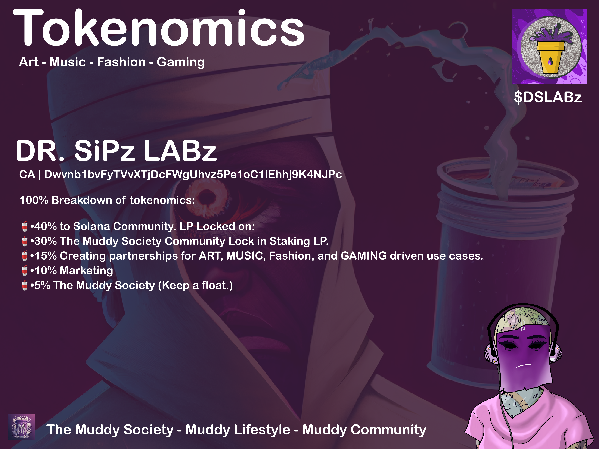

# 🪙 Tokenoimcs

<figure><figcaption></figcaption></figure>

### 100% Breakdown of tokenomics:

40% to Solana Community. LP Locked on: [https://www.guacamole.gg/launch/lock/view/9mebDcdWRDoQn2ANeRrQmJYecaLro9kaNRhL7kmn53yN](https://www.guacamole.gg/launch/lock/view/9mebDcdWRDoQn2ANeRrQmJYecaLro9kaNRhL7kmn53yN)

30% The Muddy Society Community Lock in Staking LP.

15% Creating partnerships for ART and MUSIC driven use cases.

10% Marketing

5% The Muddy Society (Keep a float.)

## Phase 1:&#x20;

* Use Case mint with token Women's Muddy NFT (Bad Batch)&#x20;
* Burn Tokens was use to mint from new holders.
* Raffles
* Giveaways

## Phase 2:

* Stealth Launch Token (Low LP)&#x20;
* Pair Token $DSLABz/$SOL on [<mark style="color:purple;">**Raydium**</mark>](#user-content-fn-1)[^1] OpenBook Address: 9mebDcdWRDoQn2ANeRrQmJYecaLro9kaNRhL7kmn53yN
* Second Part Mint to burn.

## Phase 3:&#x20;

* $DSLABz/USDC Pair. (WEN) 2024
* List on other dex markets. (WEN) 2024
* Market Presale for USDC pair event. (WEN) 2024
* Build for the ecosystems of the token. (WEN) 2024
* Grants: Founder Grants Meaning Partnership, Small Community Grants.&#x20;
* Update token to 2022 when program software is out and ready from the creators of the program token2022.&#x20;

(MINTED OUT) Launch My NFT: [https://launchmynft.io/collections/H31SYRshCgCoe1wVAnVzXFn9zyPLkME6vqujDBFDMmns/LPUPrnKFXPvFhqdRgONc](https://launchmynft.io/collections/H31SYRshCgCoe1wVAnVzXFn9zyPLkME6vqujDBFDMmns/LPUPrnKFXPvFhqdRgONc)

(SECONDARY MARKET) Magic Eden: [https://magiceden.io/marketplace/wmnft](https://magiceden.io/marketplace/wmnft)

[^1]: Click To Start Trading

